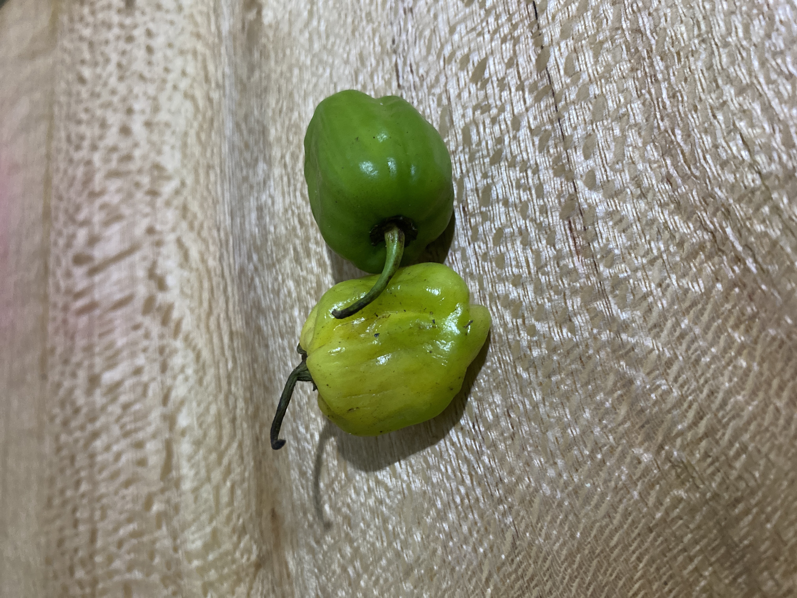

# Tasting Notes  
###   
### Lemon  
  
Surprisingly more segmented than the orange, about just as chewy.  Quite a bit of pith in the skin.  Slightly less sour than a lemon you get at Trader Joe’s and a touch more bitter.    
  
### Spicy Pilipili   
  
Pretty spicy about as hot as a Serrano.  It has an off-putting chemical taste like what I imagine spicy turpentine would taste like.  It warms you up quite a bit.  It has a slight numbing sensation similar to Chinese chili oil.  Overall I appreciate that it has more flavor than common jalapeños but the flavor isn’t super pleasing.    
  
  
### Eggplant  
  
Small eggplant, more bitter than the European variety you get in the States.  Firmer skin.  Goes well with pasta in red sauce which you have to make from scratch because Tanzania.      
  
### Roma Tomatoes  
  
Better than US which are atrociously bland.  Nice deep red color.  I’ve always thought tomatoes taste salty probably because they contain naturally occurring MSG.  These have more MSG for sure.    
  
### Mango  
  
Possibly the best fruit in Tanzania.  Consistently, perfectly sweet.  It’s everything a mango tastes like plus subtle smoky notes of caramel or burnt sugar.  When I first came to TZ I would put a piece in my mouth and just meditate on the smoky sweetness.  
Probably makes good moonshine or something.    
  
### Sweetsop or Custard Apple  
  
  
Creamy like custard; banana, guava, and apple notes.  About as sweet as a papaya.  I would eat this every day if it was in the US.  But then it would taste half as good and cost $6 each.  I got it for 300 Tanzanian shillings which is 12 cents.    
  
### Pineapple   
Close your eyes and you’re in fucking Hawaii.  Hands down the third best fruit in Tanzania.  Consistently and perfectly sweet; an intense pineapple flavor, almost like bubble gum.  Never too fibrous, the chunks just melt into juice in your mouth.    
  
1000 Shillings or 40 cents a pineapple.  If only Tanzania had freeways and refrigerated trucks, the could sell these in Europe at $7 a pop.  But no.  This is Tanzania, where the speed limit is 50 kph on a two lane highway, and there’s always traffic.   
